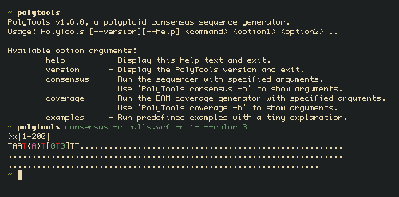

# PolyTools



This tool allows for the generation of a consensus sequences of polyploid genomes from NGS reads.

## Installation

Make sure you meet the requirements.
You need to have the Java runtime environment installed (version 1.8 and above) and you need to have the JAVA\_HOME variable in your system settings.
You can download the java enviroment at [Java](https://www.java.com/en/download/help/download\_options.xml).

You can now run the program by executing:
```
$ java -jar polytools-<version>.jar <command> <option1> <option2> ..
```
To see which commands you can run.

Try:
```
$ java -jar polytools-<version>.jar --help
```

Or run:
```
$ java -jar polytools-<version>.jar -examples
```
Now you see some example commands that explain the functionality of the program.

You can find more examples and explanation of the commands in the manual at the [Project Wiki](https://gitlab.ewi.tudelft.nl/TI2806/2017-2018/PL/pl4/pl4/wikis/home) under documents.

### Requirements
* Java runtime environment (verion 1.8 and above) [Java](https://www.java.com/en/download/help/download\_options.xml).


## Features

This consensus sequence generator includes:
* Heterozygous support
* Polyploid support
* Labeling
* Regions
* Filters
* Zip VCF support

## VCF support

Verified VCF versions and verified variant callers (e.g. source)

* VCF v4.1
    * gatk
    * Pilon v1.22
    * Freebays v1.2.0
* VCF v4.2
    * Freebays v1.2.0


## Development

Download the `master`. Open the project in your favorite IDE. Make sure you have gradle available in your IDE, see Built with.

### Testing

Running the tests is done by Gradle.

Try:
```
> ./gradlew test
```


### Built With

* [Gradle](https://gradle.org/) - Dependency Management
* [HTSJDK](https://github.com/samtools/htsjdk) - VCF file parser

## Other comparable projects

* [BcfTools](https://github.com/samtools/bcftools/) - Utilities for variant calling and manipulating VCFs and BCF
* [JVARKIT](https://github.com/lindenb/jvarkit) - Java utilities for Bioinformatics
* [VCF-kit](https://github.com/AndersenLab/VCF-kit) - Command-line based utilities for performing analysis on VCF files.

## Releases

A overview of the releases can be found

## Authors
**Arjan Seijs**
**Bas Jenneboer** 
**Erik Sennema**
**Koen du Buf**
**Regi Veerhuis**